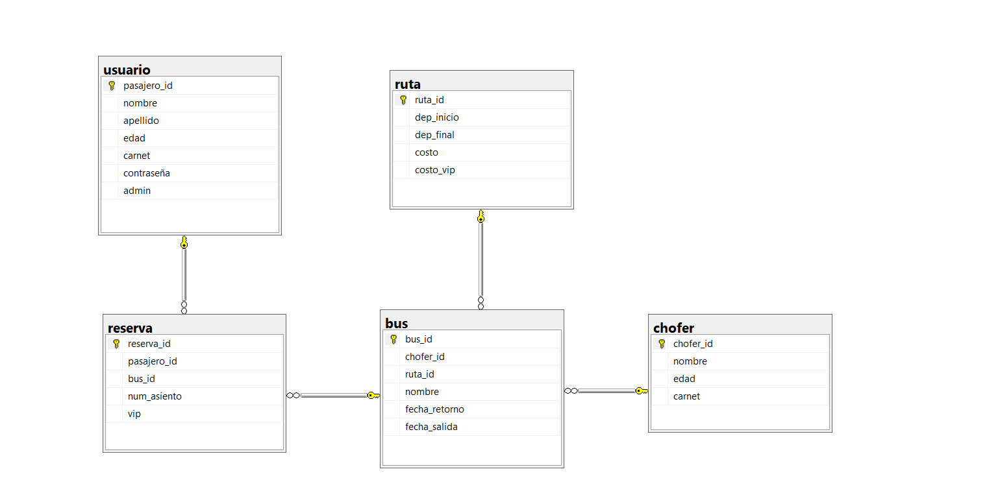

<!-- Markdown -->
<div style="display: flex; justify-content: ">
  <h1 style="margin: 0;">PASA "Viajar nunca fue más simple" </h1>
</div>

Este proyecto implementa un sistema de migración y gestión de datos para una empresa de buses, permitiendo la transición desde un sistema heredado en SQL Server a una nueva implementación en MySQL además con una interfaz gráfica que complementa al proyecto.</p>

## 🚌 Descripción del Proyecto

El sistema moderniza la gestión de datos de una empresa de buses, facilitando:
- Migración desde SQL Server a MySQL
- Preservación de la integridad de datos
- Manejo eficiente de registros
- Interfaz para agregar informacion en dos partes admin y usuario
- Interfaz comoda y facil de usar

## ✨ Funcionalidades

- Migración completa de esquemas
- Preservación de relaciones
- Validación de datos
- Sistema de prevención de duplicados
- Gestión de errores
- Visualizar registros
- Agregar registros
- Modificar y eliminar registros
- Adaptable a las dos bases de datos
- Interfaz de usuario 
- Interfaz de admin

## 🗄️ Estructura del Proyecto

```
├──tkinter_app
│   ├──main.py                    # Codigo de la Interfaz
├──DATABASE             
│   ├──pasa.bak                   # Base de datos en MySQL_Server
├──IMAGES
│   ├──Imagenes varias            # Recursos de la Interfaz
├── mysqlserver_to_mysq
│   ├── conexion.py               # Gestión de conexiones
│   ├── main.py                   # Punto de entrada
│   ├──resources 
│       ├── functions.py          # Funciones auxiliares
│       ├── functions_main.py     # Clase principal
│       ├──queries
│           └── queries.py        # Consultas SQL
├── Readme_data                 
│   └── Imagenes varias e video   # Informacion para hacer mejor el readme 
├──LICENSE                        # Licencia MIT
```

## 🛠️ Tecnologías

### Implementadas
- Python 3.11
- SQL Server
- MySQL
- pyodbc
- mysql-connector-python
- Tkinter
- tkcalendar
- datetime
- sys y os
## 🚀 Instalación

1. Clonar el repositorio
```bash
git clone [https://github.com/alejandroramirezvallejos/PASA.git]
```

2. Configurar credenciales en `conexion.py`:
```python
# SQL Server
SERVER=''
DATABASE=''
Trusted_Connection=''

# MySQL
host=''
user=''
password=''
```

3. Instalar la base de datos en mysql_server 

4. Instalar todos los paquetes necesarios de python

## 📊 Estructura de Base de Datos

### Diagramas de relación entidad



###  Diagramas de clases
#### Traslado de base datos


#### Interfaz

## 🔄 Funcionalidades de Migración

### Proceso
1. Obtencion de informacion de destino
2. Creación de esquema
3. Migración de datos
4. Traslado a la nueva base de datos


### Validaciones
- Verificación de tablas
- Verificacion contra duplicacion
- Validación de integridad
### Pseudocodigo
#### main.py
```
# Importación de módulos
importar módulos de sistema
importar módulos de sistema operativo
agregar ruta del sistema para recursos

# Importación de módulos personalizados
importar conexión como c
desde recursos importar funciones_principales

intentar:
    # Conexión a MySQL Server
    establecer conexión a MySQL Server
    crear cursor MySQL Server

    # Conexión a MySQL
    establecer conexión a MySQL
    crear cursor MySQL

    # Migración de datos
    crear objeto de migración con cursores
    si la verificación de la base de datos pasa existe:
        imprimir mensaje de base de datos existente y finalizar
    si no:
        crear base de datos
        obtener lista de tablas

        para cada tabla en la lista de tablas:
            crear tabla
            insertar datos en la tabla
            crear clave primaria

        crear claves foráneas para todas las tablas
        confirmar cambios en MySQL

except:
    manejar excepciones y errores en la conexión a la base de datos

finalmente:
    cerrar todas las conexiones y cursores
```
#### conexion.py
```
# Importación de módulos necesarios
importar módulo pyodbc
importar módulo mysql.connector

# Definir función para conectar a SQL Server
def conectar_mysqlserver():
    """ Establece una conexión con el servidor SQL Server.
    Retorna:
    conexion (pyodbc.Connection): Objeto de conexión a SQL Server.
    """
    establecer conexión a SQL Server con pyodbc
    imprimir mensaje de conexión exitosa
    retornar objeto de conexión

# Definir función para conectar a MySQL
def conectar_mysql():
    """ Establece una conexión con el servidor MySQL.
    Retorna:
    conexion (mysql.connector.connection.MySQLConnection): Objeto de conexión a MySQL.
    """
    establecer conexión a MySQL con mysql.connector
    imprimir mensaje de conexión exitosa
    retornar objeto de conexión

# Definir función para cerrar conexiones y cursores
def cerrar_conexion(cursorms, cursormq, conexionms, conexionmq):
    """ Cierra las conexiones y cursores de SQL Server y MySQL.
    Args:
    cursorms (pyodbc.Cursor): Cursor de SQL Server.
    cursormq (mysql.connector.cursor.MySQLCursor): Cursor de MySQL.
    conexionms (pyodbc.Connection): Conexión a SQL Server.
    conexionmq (mysql.connector.connection.MySQLConnection): Conexión a MySQL.
    """
    cerrar cursor de SQL Server
    cerrar cursor de MySQL
    cerrar conexión a SQL Server
    cerrar conexión a MySQL
    imprimir mensaje de conexión cerrada

```
#### functions.py
```
# Definir función para generar definiciones de columnas
def valores_columnas(columnas: lista) -> str:
    """
    Genera una cadena de texto con las definiciones de columnas para una tabla SQL.
    Args:
    columnas (lista): Lista de tuplas que representan las columnas, donde cada tupla contiene el nombre de la columna, el tipo de dato y la longitud (si aplica).
    Retorna:
    str: Cadena de texto con las definiciones de columnas para una tabla SQL.
    """
    inicializar cadena vacía para valores de columnas

    para cada columna en la lista de columnas:
        si el tipo de dato es 'bit':
            agregar definición de columna como BOOLEAN
        si no, si la longitud de la columna no es None:
            agregar definición de columna con longitud específica
        si no:
            agregar definición de columna sin longitud específica

    agregar fecha_modificacion como DATE al final
    retornar cadena de valores de columnas

# Definir función para generar valores de una fila
def valores_filas(fila: lista) -> str:
    """
    Genera una cadena de texto con los valores de una fila para una inserción SQL.
    Args:
    fila (lista): Lista de valores que representan una fila de datos.
    Retorna:
    str: Cadena de texto con los valores de la fila formateados para una inserción SQL.
    """
    inicializar cadena vacía para valores de fila

    para cada valor en la lista de valores de fila:
        si el valor es True:
            establecer valor como 1
        si no, si el valor es False:
            establecer valor como 0
        agregar el valor a la cadena de valores, formateado como cadena de texto

    retornar cadena de valores sin la última coma
```
#### functions_main.py
```
# Importación de módulos necesarios
importar dataclass de dataclasses
importar consultas desde queries
importar funciones
importar pyodbc
importar mysql.connector

# Definir la clase MIGRACION utilizando dataclass
@dataclass
class MIGRACION:
    # Atributos de la clase
    cursorms: pyodbc.Cursor
    cursormq: mysql.connector.cursor.MySQLCursor

    # Método para crear la base de datos
    def CREAR_BASE(self):
        """
        Crea la base de datos en MySQL y la selecciona para su uso.
        Ejecuta las consultas definidas en q.CREAR_DATABASE y q.USAR_DATABASE.
        """
        ejecutar consulta para crear base de datos en MySQL
        ejecutar consulta para usar la base de datos en MySQL

    # Método para obtener las tablas de SQL Server
    def OBTENER_TABLAS(self) -> lista:
        """
        Obtiene la lista de tablas desde SQL Server.
        Ejecuta la consulta definida en q.OBTENER_TABLAS y devuelve los resultados.
        Retorna: lista de tablas obtenidas de SQL Server.
        """
        ejecutar consulta para obtener tablas de SQL Server
        retornar lista de tablas obtenidas

    # Método para crear una tabla en MySQL
    def CREAR_TABLA(self, tabla: tuple):
        """
        Crea una tabla en MySQL basada en la estructura de una tabla en SQL Server.
        Args: tabla (tuple): Tupla que contiene el nombre de la tabla.
        """
        ejecutar consulta para extraer columnas de la tabla en SQL Server
        obtener columnas de la tabla
        ejecutar consulta para crear la tabla en MySQL con las columnas obtenidas
        verificar si la tabla se creó correctamente

    # Método para insertar datos en una tabla en MySQL
    def METER_DATOS_TABLA(self, tabla: tuple):
        """
        Inserta los datos de una tabla de SQL Server en la tabla correspondiente en MySQL.
        Args: tabla (tuple): Tupla que contiene el nombre de la tabla.
        """
        ejecutar consulta para obtener datos de la tabla en SQL Server
        obtener filas de datos de la tabla
        para cada fila de datos:
            ejecutar consulta para insertar datos en la tabla en MySQL
        verificar si el número de filas insertadas es correcto

    # Método para crear la clave primaria en una tabla en MySQL
    def CREAR_PK(self, tabla: tuple):
        """
        Crea la clave primaria para una tabla en MySQL basada en la clave primaria de SQL Server.
        Args: tabla (tuple): Tupla que contiene el nombre de la tabla.
        """
        ejecutar consulta para obtener la clave primaria de la tabla en SQL Server
        obtener clave primaria
        ejecutar consulta para insertar la clave primaria en la tabla en MySQL

    # Método para crear claves foráneas en las tablas en MySQL
    def CREAR_FK(self, tablas: lista):
        """
        Crea las claves foráneas para las tablas en MySQL basadas en las claves foráneas de SQL Server.
        Args: tablas (lista): Lista de tuplas que contienen los nombres de las tablas.
        """
        para cada tabla en la lista de tablas:
            ejecutar consulta para obtener claves foráneas de la tabla en SQL Server
            obtener lista de claves foráneas
            para cada clave foránea:
                ejecutar consulta para insertar clave foránea en la tabla en MySQL

    # Método para verificar si la base de datos existe en MySQL
    def VERIFICACION(self) -> bool:
        """
        Verifica si la base de datos existe en MySQL.
        Ejecuta la consulta definida en q.EXISTE_BASE y devuelve True si la base de datos existe, False en caso contrario.
        Retorna: bool, True si la base de datos existe, False en caso contrario.
        """
        ejecutar consulta para verificar existencia de la base de datos en MySQL
        obtener resultado de la consulta
        retornar True si la base de datos existe, de lo contrario retornar False

```
#### queries
```
# Definición de consultas SQL

# Consulta para crear la base de datos si no existe
CREAR_DATABASE = "Crear base de datos si no existe pasa;"

# Consulta para usar la base de datos
USAR_DATABASE = "Usar la base de datos pasa;"

# Consulta para obtener tablas de la base de datos
OBTENER_TABLAS = "Seleccionar nombre de tabla desde el esquema de información donde el tipo de tabla es 'BASE TABLE' y el catálogo de la tabla es 'pasa' y el nombre de la tabla no es 'sysdiagrams'"

# Consulta para extraer columnas de una tabla
EXTRAER_COLUMNAS = "Seleccionar nombre de columna, tipo de dato, longitud máxima de carácter desde el esquema de información de columnas donde el nombre de la tabla es '{}';"

# Consulta para crear una tabla si no existe
CREAR_TABLA = "Crear tabla si no existe {} ({});"

# Consulta para comprobar la existencia de una tabla
COMPROBAR_TABLA = "Mostrar tablas como '{}';"

# Consulta para obtener datos de una tabla
OBTENER_DATOS = "Seleccionar * desde {};"

# Consulta para insertar datos en una tabla
INSERTAR_DATOS = "Insertar en {} valores ({}, NOW());"

# Consulta para comprobar el número de filas en una tabla
COMPROBAR_DATOS = "Seleccionar contar(*) desde {};"

# Consulta para obtener la clave primaria de una tabla
OBTENER_PK = "Seleccionar nombre de columna desde el esquema de información de uso de claves donde el nombre de la tabla es '{}' y el nombre de la restricción es como 'PK_%';"

# Consulta para insertar la clave primaria en una tabla
INSERTAR_PK = "Alterar tabla {} agregar clave primaria ({});"

# Consulta para obtener claves foráneas de una tabla
OBTENER_FK = """
Seleccionar 
    nombre de clave foránea, 
    nombre de tabla principal, 
    nombre de columna principal, 
    nombre de tabla referenciada, 
    nombre de columna referenciada 
desde llaves foráneas de sys 
unirse con columnas de llaves foráneas de sys 
en id de objeto de la restricción 
unirse con tablas de sys 
en id de objeto padre 
unirse con columnas de sys 
en id de columna padre y id de objeto padre 
unirse con tablas de sys 
en id de objeto referenciado 
unirse con columnas de sys 
en id de columna referenciada 
y id de objeto referenciado 
donde el nombre de la tabla es '{}';"""

# Consulta para insertar claves foráneas en una tabla
INSERTAR_FK = "Alterar tabla {} agregar restricción {} clave foránea ({}) referencias {} ({});"

# Consulta para verificar la existencia de la base de datos
EXISTE_BASE = "Seleccionar nombre de esquema desde el esquema de información de esquemas donde el nombre del esquema es 'pasa';"

```

## 🎯 Interfaz de Usuario 

### Características Implementadas
- Interfaz amigable siendo facil de usar
- Mostrar datos almacenados
- Editar la base de datos si es admin
- El usuario solo puede agregar registros

### Validaciones
- Validacion de datos antes de enviarlos a la base de usuario
- Mensaje de confirmacion
- Confirmar las entradas
- Ver la integridad
### Pseudocodigo

## 🧪 Pruebas

### Tests Implementados
- Verificación de migración
- Validación de datos
- Uso de ```assert``` para asegurar consistencia de datos.
- Verficar la edicion en la base de datos
- Mostrar mensajes claros en caso de errores
- Ver que la base de datos se mantenga consistente
- Cierre de conexion 


## 👥 Equipo y Contribuciones

### Equipo Principal
```
Alejandro Ramirez
Josue Balbontin
```

### Cómo Contribuir
1. Fork del proyecto
2. Crear rama feature
3. Commit cambios
4. Push a la rama
5. Crear Pull Request

## 📄 Licencia

MIT License 

Copyright (c) 2024 Alejandro Ramírez and Josue Balbontin