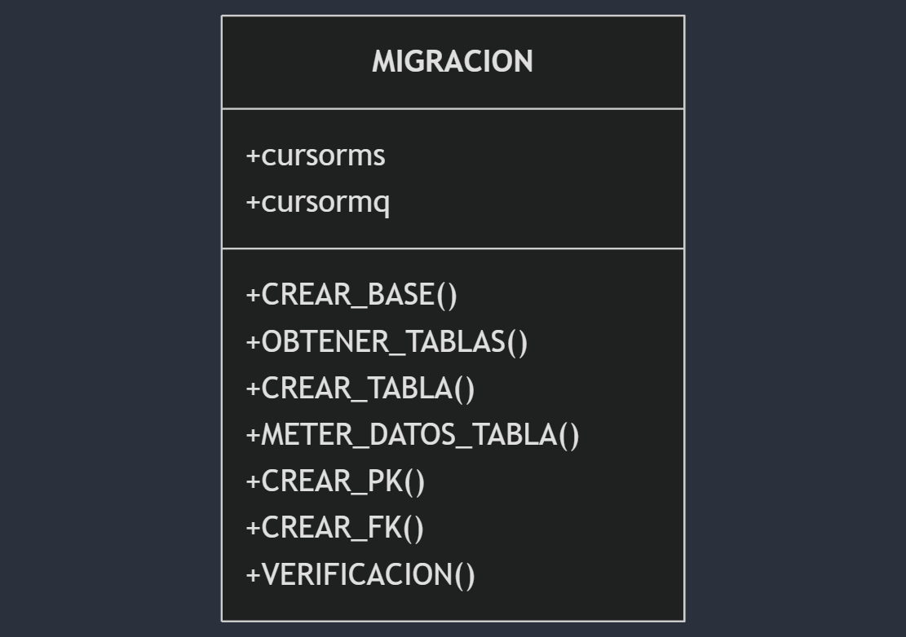

<!-- Markdown -->
<div style="display: flex; justify-content: ">
  <h1 style="margin: 0;" >  PASA "Viajar nunca fue más simple" </h1>
</div>
Este proyecto implementa un sistema de migración y gestión de datos para una empresa de buses, permitiendo la transición desde un sistema heredado en SQL Server a una nueva implementación en MySQL además con una interfaz gráfica que complementa al proyecto.</p>

## Video

[](https://drive.google.com/file/d/1NAG6RkiZN7XI502VA-ma2FuVwAHScZMw/view)

## 🚌 Descripción del Proyecto

El sistema moderniza la gestión de datos de una empresa de buses, facilitando:
- Migración desde SQL Server a MySQL
- Preservación de la integridad de datos
- Manejo eficiente de registros
- Interfaz para agregar informacion en dos partes admin y usuario
- Interfaz comoda y facil de usar

## ✨ Funcionalidades

- Migración completa de esquemas
- Preservación de relaciones
- Validación de datos
- Sistema de prevención de duplicados
- Gestión de errores
- Visualizar registros
- Agregar registros
- Modificar y eliminar registros
- Adaptable a las dos bases de datos
- Interfaz de usuario 
- Interfaz de admin

## 🗄️ Estructura del Proyecto

```
├──ASSETS                         # Recursos de la Interfaz
├──DATABASE             
│   ├──pasa.bak                   # Base de datos en MySQL_Server
├──IMAGES               
│   ├──Imagenes varias            # Recurso para readme
├──TKINTER_APP
│   ├──ADMIN_APP                  # Interfaz Administrador
│   ├──USER_APP                   # Interaz Usuario
├── mysqlserver_to_mysq
│   ├── conexion.py               # Gestión de conexiones
│   ├── main.py                   # Punto de entrada
│   ├──resources 
│       ├── functions.py          # Funciones auxiliares
│       ├── functions_main.py     # Clase principal
│       ├──queries
│           └── queries.py        # Consultas SQL
├── README.MD                     # Este texto
├──LICENSE                        # Licencia MIT
```

## 🛠️ Tecnologías

### Implementadas
- Python 3.11
- SQL Server
- MySQL
- pyodbc
- mysql-connector-python
- Tkinter
- tkcalendar
- datetime
- sys y os
## 🚀 Instalación

1. Clonar el repositorio
```bash
git clone [https://github.com/alejandroramirezvallejos/PASA.git]
```

2. Configurar credenciales en `conexion.py`:
```python
# SQL Server
SERVER=''
DATABASE=''
Trusted_Connection=''

# MySQL
host=''
user=''
password=''
```

3. Instalar la base de datos en mysql_server 

4. Instalar todos los paquetes necesarios de python

## 📊 Estructura de Base de Datos

### Diagramas de relación entidad


###  Diagramas de clases
#### Traslado de base datos



#### Interfaz

## 🔄 Funcionalidades de Migración

### Proceso
1. Obtencion de informacion de destino
2. Creación de esquema
3. Migración de datos
4. Traslado a la nueva base de datos


### Validaciones
- Verificación de tablas
- Verificacion contra duplicacion
- Validación de integridad
### Pseudocodigo
#### main.py
```
# Importación de módulos
importar módulos de sistema
importar módulos de sistema operativo
agregar ruta del sistema para recursos

# Importación de módulos personalizados
importar conexión como c
desde recursos importar funciones_principales

intentar:
    # Conexión a MySQL Server
    establecer conexión a MySQL Server
    crear cursor MySQL Server

    # Conexión a MySQL
    establecer conexión a MySQL
    crear cursor MySQL

    # Migración de datos
    crear objeto de migración con cursores
    si la verificación de la base de datos pasa existe:
        imprimir mensaje de base de datos existente y finalizar
    si no:
        crear base de datos
        obtener lista de tablas

        para cada tabla en la lista de tablas:
            crear tabla
            insertar datos en la tabla
            crear clave primaria

        crear claves foráneas para todas las tablas
        confirmar cambios en MySQL

except:
    manejar excepciones y errores en la conexión a la base de datos

finalmente:
    cerrar todas las conexiones y cursores
```
#### conexion.py
```
# Importación de módulos necesarios
importar módulo pyodbc
importar módulo mysql.connector

# Definir función para conectar a SQL Server
def conectar_mysqlserver():
    """ Establece una conexión con el servidor SQL Server.
    Retorna:
    conexion (pyodbc.Connection): Objeto de conexión a SQL Server.
    """
    establecer conexión a SQL Server con pyodbc
    imprimir mensaje de conexión exitosa
    retornar objeto de conexión

# Definir función para conectar a MySQL
def conectar_mysql():
    """ Establece una conexión con el servidor MySQL.
    Retorna:
    conexion (mysql.connector.connection.MySQLConnection): Objeto de conexión a MySQL.
    """
    establecer conexión a MySQL con mysql.connector
    imprimir mensaje de conexión exitosa
    retornar objeto de conexión

# Definir función para cerrar conexiones y cursores
def cerrar_conexion(cursorms, cursormq, conexionms, conexionmq):
    """ Cierra las conexiones y cursores de SQL Server y MySQL.
    Args:
    cursorms (pyodbc.Cursor): Cursor de SQL Server.
    cursormq (mysql.connector.cursor.MySQLCursor): Cursor de MySQL.
    conexionms (pyodbc.Connection): Conexión a SQL Server.
    conexionmq (mysql.connector.connection.MySQLConnection): Conexión a MySQL.
    """
    cerrar cursor de SQL Server
    cerrar cursor de MySQL
    cerrar conexión a SQL Server
    cerrar conexión a MySQL
    imprimir mensaje de conexión cerrada

```
#### functions.py
```
# Definir función para generar definiciones de columnas
def valores_columnas(columnas: lista) -> str:
    """
    Genera una cadena de texto con las definiciones de columnas para una tabla SQL.
    Args:
    columnas (lista): Lista de tuplas que representan las columnas, donde cada tupla contiene el nombre de la columna, el tipo de dato y la longitud (si aplica).
    Retorna:
    str: Cadena de texto con las definiciones de columnas para una tabla SQL.
    """
    inicializar cadena vacía para valores de columnas

    para cada columna en la lista de columnas:
        si el tipo de dato es 'bit':
            agregar definición de columna como BOOLEAN
        si no, si la longitud de la columna no es None:
            agregar definición de columna con longitud específica
        si no:
            agregar definición de columna sin longitud específica

    agregar fecha_modificacion como DATE al final
    retornar cadena de valores de columnas

# Definir función para generar valores de una fila
def valores_filas(fila: lista) -> str:
    """
    Genera una cadena de texto con los valores de una fila para una inserción SQL.
    Args:
    fila (lista): Lista de valores que representan una fila de datos.
    Retorna:
    str: Cadena de texto con los valores de la fila formateados para una inserción SQL.
    """
    inicializar cadena vacía para valores de fila

    para cada valor en la lista de valores de fila:
        si el valor es True:
            establecer valor como 1
        si no, si el valor es False:
            establecer valor como 0
        agregar el valor a la cadena de valores, formateado como cadena de texto

    retornar cadena de valores sin la última coma
```
#### functions_main.py
```
# Importación de módulos necesarios
importar dataclass de dataclasses
importar consultas desde queries
importar funciones
importar pyodbc
importar mysql.connector

# Definir la clase MIGRACION utilizando dataclass
@dataclass
class MIGRACION:
    # Atributos de la clase
    cursorms: pyodbc.Cursor
    cursormq: mysql.connector.cursor.MySQLCursor

    # Método para crear la base de datos
    def CREAR_BASE(self):
        """
        Crea la base de datos en MySQL y la selecciona para su uso.
        Ejecuta las consultas definidas en q.CREAR_DATABASE y q.USAR_DATABASE.
        """
        ejecutar consulta para crear base de datos en MySQL
        ejecutar consulta para usar la base de datos en MySQL

    # Método para obtener las tablas de SQL Server
    def OBTENER_TABLAS(self) -> lista:
        """
        Obtiene la lista de tablas desde SQL Server.
        Ejecuta la consulta definida en q.OBTENER_TABLAS y devuelve los resultados.
        Retorna: lista de tablas obtenidas de SQL Server.
        """
        ejecutar consulta para obtener tablas de SQL Server
        retornar lista de tablas obtenidas

    # Método para crear una tabla en MySQL
    def CREAR_TABLA(self, tabla: tuple):
        """
        Crea una tabla en MySQL basada en la estructura de una tabla en SQL Server.
        Args: tabla (tuple): Tupla que contiene el nombre de la tabla.
        """
        ejecutar consulta para extraer columnas de la tabla en SQL Server
        obtener columnas de la tabla
        ejecutar consulta para crear la tabla en MySQL con las columnas obtenidas
        verificar si la tabla se creó correctamente

    # Método para insertar datos en una tabla en MySQL
    def METER_DATOS_TABLA(self, tabla: tuple):
        """
        Inserta los datos de una tabla de SQL Server en la tabla correspondiente en MySQL.
        Args: tabla (tuple): Tupla que contiene el nombre de la tabla.
        """
        ejecutar consulta para obtener datos de la tabla en SQL Server
        obtener filas de datos de la tabla
        para cada fila de datos:
            ejecutar consulta para insertar datos en la tabla en MySQL
        verificar si el número de filas insertadas es correcto

    # Método para crear la clave primaria en una tabla en MySQL
    def CREAR_PK(self, tabla: tuple):
        """
        Crea la clave primaria para una tabla en MySQL basada en la clave primaria de SQL Server.
        Args: tabla (tuple): Tupla que contiene el nombre de la tabla.
        """
        ejecutar consulta para obtener la clave primaria de la tabla en SQL Server
        obtener clave primaria
        ejecutar consulta para insertar la clave primaria en la tabla en MySQL

    # Método para crear claves foráneas en las tablas en MySQL
    def CREAR_FK(self, tablas: lista):
        """
        Crea las claves foráneas para las tablas en MySQL basadas en las claves foráneas de SQL Server.
        Args: tablas (lista): Lista de tuplas que contienen los nombres de las tablas.
        """
        para cada tabla en la lista de tablas:
            ejecutar consulta para obtener claves foráneas de la tabla en SQL Server
            obtener lista de claves foráneas
            para cada clave foránea:
                ejecutar consulta para insertar clave foránea en la tabla en MySQL

    # Método para verificar si la base de datos existe en MySQL
    def VERIFICACION(self) -> bool:
        """
        Verifica si la base de datos existe en MySQL.
        Ejecuta la consulta definida en q.EXISTE_BASE y devuelve True si la base de datos existe, False en caso contrario.
        Retorna: bool, True si la base de datos existe, False en caso contrario.
        """
        ejecutar consulta para verificar existencia de la base de datos en MySQL
        obtener resultado de la consulta
        retornar True si la base de datos existe, de lo contrario retornar False

```
#### queries
```
# Definición de consultas SQL

# Consulta para crear la base de datos si no existe
CREAR_DATABASE = "Crear base de datos si no existe pasa;"

# Consulta para usar la base de datos
USAR_DATABASE = "Usar la base de datos pasa;"

# Consulta para obtener tablas de la base de datos
OBTENER_TABLAS = "Seleccionar nombre de tabla desde el esquema de información donde el tipo de tabla es 'BASE TABLE' y el catálogo de la tabla es 'pasa' y el nombre de la tabla no es 'sysdiagrams'"

# Consulta para extraer columnas de una tabla
EXTRAER_COLUMNAS = "Seleccionar nombre de columna, tipo de dato, longitud máxima de carácter desde el esquema de información de columnas donde el nombre de la tabla es '{}';"

# Consulta para crear una tabla si no existe
CREAR_TABLA = "Crear tabla si no existe {} ({});"

# Consulta para comprobar la existencia de una tabla
COMPROBAR_TABLA = "Mostrar tablas como '{}';"

# Consulta para obtener datos de una tabla
OBTENER_DATOS = "Seleccionar * desde {};"

# Consulta para insertar datos en una tabla
INSERTAR_DATOS = "Insertar en {} valores ({}, NOW());"

# Consulta para comprobar el número de filas en una tabla
COMPROBAR_DATOS = "Seleccionar contar(*) desde {};"

# Consulta para obtener la clave primaria de una tabla
OBTENER_PK = "Seleccionar nombre de columna desde el esquema de información de uso de claves donde el nombre de la tabla es '{}' y el nombre de la restricción es como 'PK_%';"

# Consulta para insertar la clave primaria en una tabla
INSERTAR_PK = "Alterar tabla {} agregar clave primaria ({});"

# Consulta para obtener claves foráneas de una tabla
OBTENER_FK = """
Seleccionar 
    nombre de clave foránea, 
    nombre de tabla principal, 
    nombre de columna principal, 
    nombre de tabla referenciada, 
    nombre de columna referenciada 
desde llaves foráneas de sys 
unirse con columnas de llaves foráneas de sys 
en id de objeto de la restricción 
unirse con tablas de sys 
en id de objeto padre 
unirse con columnas de sys 
en id de columna padre y id de objeto padre 
unirse con tablas de sys 
en id de objeto referenciado 
unirse con columnas de sys 
en id de columna referenciada 
y id de objeto referenciado 
donde el nombre de la tabla es '{}';"""

# Consulta para insertar claves foráneas en una tabla
INSERTAR_FK = "Alterar tabla {} agregar restricción {} clave foránea ({}) referencias {} ({});"

# Consulta para verificar la existencia de la base de datos
EXISTE_BASE = "Seleccionar nombre de esquema desde el esquema de información de esquemas donde el nombre del esquema es 'pasa';"

```

## 🎯 Interfaz de Usuario 

### Características Implementadas
- Interfaz amigable siendo facil de usar
- Mostrar datos almacenados
- Editar la base de datos si es admin
- El usuario solo puede agregar registros

### Validaciones
- Validacion de datos antes de enviarlos a la base de usuario
- Mensaje de confirmacion
- Confirmar las entradas
- Ver la integridad
### Pseudocodigo
#### USUARIO
```
Sistema de Reservas de Buses

Inicio:
1. Configurar dependencias y bibliotecas:
   - Instalar tkinter, pyodbc, customtkinter, pillow, tkcalendar.

2. Configurar conexion a base de datos:
   - Definir DRIVER, SERVER, DATABASE, y credenciales de usuario.

3. Definir funciones principales:

   Funciones de Conexion:
   - Conectar a la base de datos:
     - Intentar establecer conexion usando las credenciales.
     - Si hay error, mostrar mensaje.

   Funciones de Usuarios:
   - Crear cuenta:
     - Recoger datos de entrada: nombre, apellido, edad, carnet, contraseña.
     - Validar:
       - Nombre, apellido no vacíos.
       - Edad mayor o igual a 18.
       - Carnet con 7 dígitos.
       - Contraseña no vacía.
     - Insertar datos en tabla de usuarios.
     - Mostrar pantalla principal si es exitoso.

   - Iniciar sesión:
     - Recoger credenciales: carnet y contraseña.
     - Validar:
       - Carnet con 7 dígitos.
       - Contraseña no vacía.
     - Consultar base de datos para verificar usuario.
     - Mostrar pantalla principal si es correcto.

   Funciones de Reservas:
   - Buscar buses:
     - Recoger datos: origen, destino, fecha salida, fecha regreso, pasajeros, clase.
     - Validar:
       - Origen y destino diferentes.
       - Fecha de salida seleccionada.
       - Numero de pasajeros entre 1 y 60.
     - Consultar base de datos:
       - Obtener buses disponibles según origen, destino y fechas.
     - Mostrar resultados.

   - Confirmar reserva:
     - Recoger buses seleccionados y detalles del usuario.
     - Insertar reservas en la base de datos.
     - Mostrar mensaje de confirmación.

4. Diseño de interfaz:

   Pantalla Inicial:
   - Mostrar logo y opciones: "Iniciar sesión" y "Crear cuenta".

   Pantalla de Inicio de Sesión:
   - Formularios para carnet y contraseña.
   - Botón para validar.

   Pantalla de Creación de Cuenta:
   - Formularios para nombre, apellido, edad, carnet y contraseña.
   - Botón para registrar.

   Pantalla Principal:
   - Campos para origen, destino, fechas, pasajeros y clase.
   - Botón para buscar buses.

   Pantalla de Resultados:
   - Lista de buses disponibles.
   - Botón para confirmar selección.

5. Gestion de Eventos:
   - Cambiar entre pantallas según acciones del usuario.
   - Validar datos antes de interactuar con la base de datos.
   - Habilitar o deshabilitar botones según estado de la aplicación.

Fin.
```
#### ADMIN
```
1. Importar las librerías necesarias
   - Instalar tk 
   - Instalar pyodbc 
   - Instalar tkcalendar 
   - Instalar pillow 
   - Instalar customtkinter

2. Definir la configuración de la conexión con la base de datos
   - Asignar el controlador de ODBC
   - Asignar el servidor de la base de datos
   - Asignar el nombre de la base de datos
   - Asignar el nombre de usuario

3. Crear una función para establecer la conexión con la base de datos
   - Intentar conectar usando los parámetros definidos
     - Retornar la conexión si es exitosa
   - Manejar posibles errores de conexión
     - Si el error es de credenciales, mostrar mensaje de error específico
     - Mostrar mensaje de error general para otros problemas de conexión
     - Retornar `None` en caso de error

4. Definir la función para obtener una nueva llave primaria (obtain_pk)
   - Ejecutar una consulta para seleccionar el ID de la tabla ordenado en orden descendente
   - Retornar el siguiente valor del ID

5. Definir la función para validar un carnet (validate_carnet)
   - Crear la conexión usando 'make_connection'
   - Crear un cursor
   - Ejecutar una consulta para seleccionar el carnet en la tabla de usuarios
   - Verificar si el valor del carnet existe
     - Retornar False si no existe
     - Retornar True si existe

6. Definir funciones para obtener datos de diferentes tablas
   - Obtener todas las filas de la tabla rutas (get_route)
   - Obtener todas las filas de la tabla bus (get_bus)
   - Obtener todas las filas de la tabla chofer (get_driver)
   - Obtener todas las reservas con información adicional (get_booking)

7. Definir funciones para adicionar datos a las tablas
   - Adicionar un bus a la tabla bus (add_bus)
     - Crear la conexión y el cursor
     - Ejecutar una consulta para insertar un nuevo bus
     - Confirmar los cambios
   - Adicionar un chofer a la tabla chofer (add_driver)
     - Crear la conexión y el cursor
     - Ejecutar una consulta para insertar un nuevo chofer
     - Confirmar los cambios
   - Adicionar una ruta a la tabla ruta (add_route)
     - Crear la conexión y el cursor
     - Ejecutar una consulta para insertar una nueva ruta
     - Confirmar los cambios

8. Definir funciones para eliminar datos de las tablas
   - Eliminar un bus por su ID (del_bus)
     - Crear la conexión y el cursor
     - Ejecutar una consulta para eliminar el bus
     - Confirmar los cambios
   - Eliminar un chofer por su ID (del_driver)
     - Crear la conexión y el cursor
     - Ejecutar una consulta para eliminar el chofer
     - Confirmar los cambios
   - Eliminar una ruta por su ID (del_route)
     - Crear la conexión y el cursor
     - Ejecutar una consulta para eliminar la ruta
     - Confirmar los cambios

9. Definir funciones para verificar y actualizar datos
   - Verificar si un ID existe en una tabla (verification_id)
     - Ejecutar una consulta para seleccionar el ID en la tabla
     - Retornar False si no existe
     - Retornar True si existe
   - Actualizar un bus y si no existe, lo crea (update_bus)
     - Crear la conexión y el cursor
     - Verificar si el ID del bus existe
       - Ejecutar una consulta para actualizar el bus si existe
       - Llamar a 'add_bus' si no existe
     - Confirmar los cambios
   - Actualizar un chofer y si no existe, lo crea (update_driver)
     - Crear la conexión y el cursor
     - Verificar si el ID del chofer existe
       - Ejecutar una consulta para actualizar el chofer si existe
       - Llamar a 'add_driver' si no existe
     - Confirmar los cambios
   - Actualizar una ruta y si no existe, lo crea (update_route)
     - Crear la conexión y el cursor
     - Verificar si el ID de la ruta existe
       - Ejecutar una consulta para actualizar la ruta si existe
       - Llamar a 'add_route' si no existe
     - Confirmar los cambios

10. Importar las librerías necesarias
   - Importar sys
   - Importar tkinter como tk y ttk
   - Importar pyodbc
   - Importar messagebox y font desde tkinter
   - Importar Calendar desde tkcalendar
   - Importar date desde datetime
   - Importar Image e ImageTk desde PIL
   - Importar customtkinter como ctk y sus componentes necesarios
   - Importar functions_query como f
   - Importar conection como c

11. Definir variables globales
   - Variables para las ventanas y frames
   - Variables para las entradas de datos y opción seleccionada

12. Crear función para guardar datos al crear una cuenta (create_account)
   - Obtener y validar la entrada de datos
   - Manejar errores de validación y mostrar mensajes de error
   - Borrar datos en caso de error
   - Conectar a la base de datos
   - Ejecutar consulta para insertar los datos del usuario
   - Cambiar al frame de consulta si todo sale bien
   - Manejar posibles errores de la base de datos

13. Crear función para extraer datos y verificar el inicio de sesión (login)
   - Obtener y validar la entrada de datos
   - Manejar errores de validación y mostrar mensajes de error
   - Borrar datos en caso de error
   - Conectar a la base de datos
   - Ejecutar consulta para verificar el usuario y la contraseña
   - Cambiar al frame de consulta si todo sale bien
   - Manejar posibles errores de la base de datos

14. Crear función para realizar consultas según la opción seleccionada (queries_option)
   - Crear la conexión y el cursor
   - Identificar la acción (agregar, eliminar, actualizar) según el frame actual
   - Ejecutar las consultas correspondientes a cada acción y opción seleccionada
   - Manejar posibles errores y mostrar mensajes de éxito o error

15. Crear función para la pantalla de carga (make_loading_screen)
   - Crear el frame de carga
   - Agregar un ícono y manejar posibles errores al cargar la imagen
   - Configurar un retraso para mostrar el siguiente frame

16. Crear el frame de la barra de acción (make_action_bar)
    - Crear el frame de la barra de acción
    - Agregar un logo al centro del frame
      - Cargar la imagen del logo
      - Manejar errores en caso de que no se pueda cargar la imagen
    - Crear un botón para regresar y ocultarlo inicialmente
      - Definir la función on_back_button para gestionar el botón de regreso
        - Verificar desde qué frame se está presionando el botón de regreso
        - Ocultar y cambiar al frame inicial correspondiente
      - Cargar la imagen del botón de regreso
      - Manejar errores en caso de que no se pueda cargar la imagen
    - Crear un botón para cerrar sesión
      - Definir la función log_out_button para gestionar el botón de cerrar sesión
        - Verificar desde qué frame se está presionando el botón de cerrar sesión
        - Ocultar y cambiar al frame inicial correspondiente
      - Cargar la imagen del botón de cerrar sesión
      - Manejar errores en caso de que no se pueda cargar la imagen

17. Crear el frame de la barra de navegación (make_navigation_bar)
    - Crear el frame de la barra de navegación
    - Definir la función para cargar iconos
      - Intentar cargar la imagen y redimensionarla
      - Manejar errores en caso de que no se pueda cargar la imagen
    - Cargar los iconos de los botones de navegación (buscar, agregar, eliminar, modificar)
      - Manejar errores en caso de que no se puedan cargar los iconos
    - Definir el estilo de los botones de navegación
    - Crear los botones de navegación y asignarles sus iconos y comandos correspondientes
      - Botón de buscar
      - Botón de agregar
      - Botón de eliminar
      - Botón de modificar

18. Crear el frame inicial (make_start_frame)
    - Crear el frame inicial y asignarle un nombre
    - Agregar un icono al frame
      - Intentar cargar la imagen del icono
      - Manejar errores en caso de que no se pueda cargar la imagen
    - Agregar un texto de título
      - Configurar la fuente, color y propiedades del texto
    - Crear y agregar el botón de inicio de sesión
      - Configurar el botón y su acción para mostrar el frame de inicio de sesión
    - Crear y agregar el botón de creación de cuenta
      - Configurar el botón y su acción para mostrar el frame de registro
    - Agregar un texto de términos y condiciones
      - Configurar el texto y sus propiedades
    - Crear un enlace para "Términos y condiciones"
      - Configurar el enlace y su acción para mostrar el frame de términos y condiciones

19. Crear el frame de términos y condiciones de uso (make_terms_frame)
    - Crear el frame de términos y condiciones y asignarle un nombre
    - Agregar un título principal
      - Configurar el título y sus propiedades
    - Crear un Scrollbar para el contenido
      - Configurar el Scrollbar y el Canvas
    - Agregar el contenido de términos y condiciones
      - Dividir el contenido en secciones
      - Crear y agregar un frame para cada sección
      - Configurar el título y contenido de cada sección
    - Agregar un botón para regresar
      - Configurar el botón de regresar y su acción

20. Crear el frame para registrar una cuenta (make_register_frame)
    - Crear el frame de registro y asignarle un nombre
    - Agregar un título y configurar sus propiedades (fuente, color, etc.)
    - Crear y agregar campos de entrada para:
      - Nombre (name_entry)
      - Apellidos (last_name_entry)
      - Edad (age_entry)
      - Carnet (id_card_entry)
      - Contraseña (password_entry)
    - Configurar los estilos y propiedades de cada campo de entrada
    - Crear y agregar el botón para crear una cuenta (create_account_button)
      - Configurar el botón y su comando para llamar a la función create_account
    - Agregar un botón de regreso (show_back_button) para navegar al frame anterior

21. Crear el frame para iniciar sesión (make_login_frame)
    - Crear el frame de inicio de sesión y asignarle un nombre
    - Agregar un título y configurar sus propiedades (fuente, color, etc.)
    - Crear y agregar campos de entrada para:
      - Carnet (login_id_card_entry)
      - Contraseña (login_password_entry)
    - Configurar los estilos y propiedades de cada campo de entrada
    - Crear y agregar el botón para iniciar sesión (login_button_submit)
      - Configurar el botón y su comando para llamar a la función login
    - Agregar un botón de regreso (show_back_button) para navegar al frame anterior

22. Crear el frame para buscar datos (make_fetch_frame)
    - Crear el frame de búsqueda de datos y asignarle un nombre
    - Definir la función para abrir una ventana con datos de una tabla (open_table_window)
      - Crear la conexión y el cursor
      - Ejecutar la función de búsqueda y obtener los datos
      - Manejar casos en los que no haya datos en la tabla
      - Crear una nueva ventana y configurar sus propiedades (tamaño, color, etc.)
      - Crear un Treeview para mostrar los datos
        - Configurar los encabezados basados en las columnas
        - Insertar los datos en el Treeview
      - Crear y agregar un botón para cerrar la ventana (close_button)
      - Manejar posibles errores durante la obtención de datos
    - Crear y agregar botones para mostrar las tablas específicas:
      - Tabla de buses (bus_button)
      - Tabla de choferes (driver_button)
      - Tabla de rutas (route_button)
      - Tabla de reservas (booking_button)
      - Configurar los botones y sus comandos para llamar a la función open_table_window con los parámetros correspondientes

23. Crear función para crear campos de entrada (create_input_field)
    - Definir la función con parámetros: parent, label_text, placeholder, identifier_button
    - Crear un frame para el campo de entrada y agregarlo al parent
    - Si identifier_button es 1:
      - Crear y configurar un label y un entry
      - Agregar el entry a la lista global de entries
    - Si identifier_button es 2:
      - Crear un frame y un botón
      - Definir la función on_button_click para gestionar la acción del botón
        - Asignar el texto del label a selected_option
        - Llamar a la función queries_option
      - Configurar el botón con su acción y agregarlo al frame

24. Crear frame para crear botones predeterminados (make_option_frame)
    - Definir la función con parámetros: parent, title_name
    - Crear un frame de opción y una entrada global (option)
    - Crear un canvas y un scrollbar
    - Configurar y vincular el canvas y el scrollbar
    - Crear un frame interno dentro del canvas (scrollable_frame)
    - Configurar un título para el bus y agregar campos de entrada según title_name (Agregar, Eliminar, Actualizar)
    - Configurar un título para el chofer y agregar campos de entrada según title_name (Agregar, Eliminar, Actualizar)
    - Configurar un título para la ruta y agregar campos de entrada según title_name (Agregar, Eliminar, Actualizar)
    - Retornar el frame de opción

25. Crear frame para agregar datos (make_add_frame)
    - Definir la función y gestionar los frames y el frame actual
    - Si add_frame es None, crear y configurar el frame
    - Si option_frame es None o su master no es add_frame, crear y configurar el option_frame
      - Llamar a make_option_frame con los parámetros adecuados y agregarlo al frame
    - Configurar y mostrar el frame actual y la opción
    - Retornar el frame de agregar datos

26. Crear el frame para modificar datos (make_update_frame)
    - Definir la función y gestionar los frames y el frame actual
    - Si update_frame es None, crear y configurar el frame
    - Si option_frame es None o su master no es update_frame, crear y configurar el option_frame
      - Llamar a make_option_frame con los parámetros adecuados y agregarlo al frame
    - Configurar y mostrar el frame actual y la opción
    - Retornar el frame de modificar datos

27. Crear el frame para eliminar datos (make_delete_frame)
    - Definir la función y gestionar los frames y el frame actual
    - Si delete_frame es None, crear y configurar el frame
    - Si option_frame es None o su master no es delete_frame, crear y configurar el option_frame
      - Llamar a make_option_frame con los parámetros adecuados y agregarlo al frame
    - Configurar y mostrar el frame actual y la opción
    - Retornar el frame de eliminar datos

28. Crear funciones para mostrar y ocultar frames (show_frame)
    - Definir la función para mostrar un frame específico (show_frame)
      - Ocultar el frame actual si existe
      - Configurar y mostrar el frame a mostrar
      - Ocultar todos los frames en la lista global de frames
      - Gestionar la visibilidad de la barra de acción, botón de regreso y botón de cierre de sesión según el frame a mostrar

29. Crear funciones para mostrar y ocultar el botón de regreso (show_back_button, hide_back_button)
    - Definir la función para mostrar el botón de regreso (show_back_button)
      - Configurar la posición del botón de regreso si existe
    - Definir la función para ocultar el botón de regreso (hide_back_button)
      - Llamar a la función on_back_button
      - Ocultar el botón de regreso si existe

30. Crear función para limpiar datos al presionar el botón de regresar (on_back_button)
    - Definir la función on_back_button
    - Limpiar los datos de entrada específicos al frame actual:
      - Si el frame actual es login_frame:
        - Borrar el contenido de login_id_card_entry y login_password_entry
      - Si el frame actual es register_frame:
        - Borrar el contenido de name_entry, last_name_entry, age_entry, id_card_entry y password_entry

31. Crear funciones para mostrar y ocultar el botón de cerrar sesión (show_log_out_button, hide_log_out_button)
    - Definir la función show_log_out_button
      - Configurar la posición del botón de cerrar sesión si existe
    - Definir la función hide_log_out_button
      - Ocultar el botón de cerrar sesión si existe

32. Crear función para limpiar datos al presionar el botón de cerrar sesión (on_log_out_button)
    - Definir la función on_log_out_button
    - Ocultar el botón de cerrar sesión
    - Mostrar el frame inicial (start_frame)

33. Crear funciones para mostrar y ocultar opciones (show_option, hide_option)
    - Definir la función show_option
      - Configurar la posición de option si existe y el target_frame es válido
    - Definir la función hide_option
      - Ocultar option si existe

34. Crear la función principal (main)
    - Configurar la ventana principal de la aplicación:
      - Establecer el modo de apariencia y el tema de color predeterminado
      - Crear la ventana principal con título, tamaño, y configuración de diseño
    - Crear las barras de acción y de navegación
    - Crear los diferentes frames de la aplicación (loading, start, register, login, add, update, delete, fetch, terms)
    - Almacenar todos los frames en una lista global (all_frames)
    - Mostrar la pantalla de carga inicialmente y luego cambiar al frame inicial después de un retraso
    - Iniciar el bucle principal de la aplicación

35. Ejecutar la función principal si se está ejecutando el script directamente (condicional if __name__ == "__main__")
    - Llamar a la función main()

```
## 🧪 Pruebas

### Tests Implementados
- Verificación de migración
- Validación de datos
- Uso de ```assert``` para asegurar consistencia de datos.
- Verficar la edicion en la base de datos
- Mostrar mensajes claros en caso de errores
- Ver que la base de datos se mantenga consistente
- Cierre de conexion 


## 👥 Equipo y Contribuciones

### Equipo Principal
```
Alejandro Ramirez
Josue Balbontin
```

### Cómo Contribuir
1. Fork del proyecto
2. Crear rama feature
3. Commit cambios
4. Push a la rama
5. Crear Pull Request

## 📄 Licencia

MIT License 

Copyright (c) 2024 Alejandro Ramírez and Josue Balbontin
